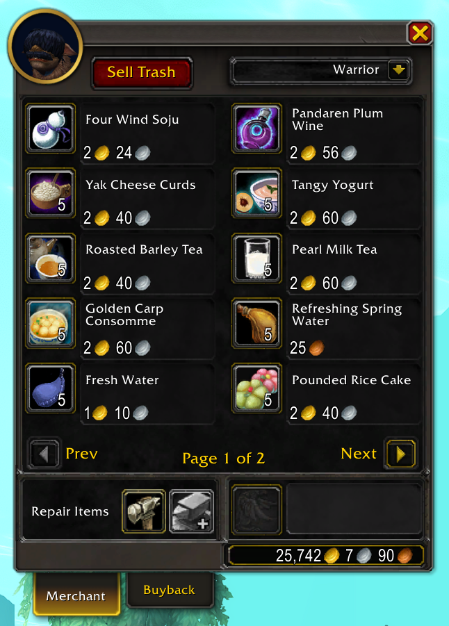

# VendorTrashButton

This is a clean and lightweight Addon for World of Warcraft
which adds a button to the merchant UI that allows to sell
all uncommon (gray) items at once.

### Settings

Settings can be found in the corresponding Addon settings
category in the game options.

- *Safe Mode* (enabled by default): only sells up to 12 items
  at once (so that items sold by accident can still be bought
  back).

### Acknowledgements

This Addon is heavily inspired by [SellJunk](https://www.curseforge.com/wow/addons/sell-junk)
(which is no longer actively maintained at this point). Regardless, it
has been implemented in a modern and clean way, and uses several
recently introduced improvements to the Addon API.